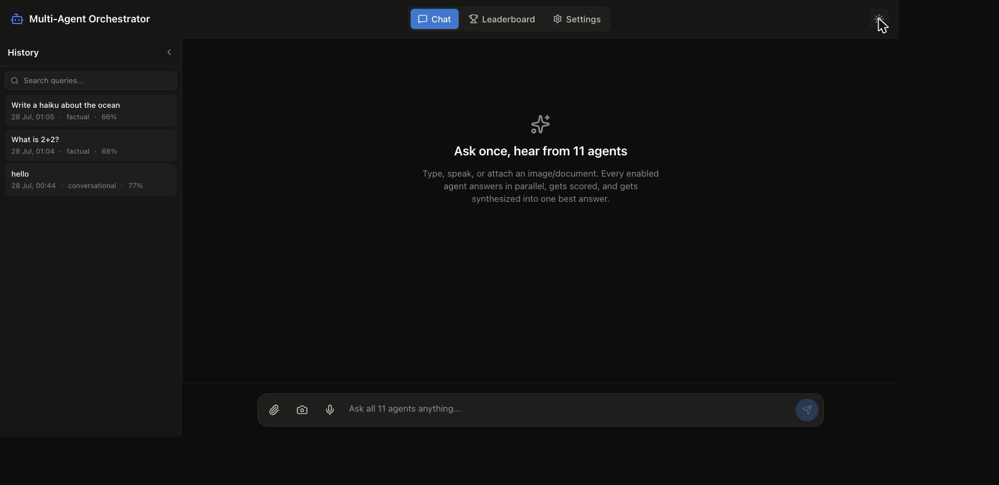
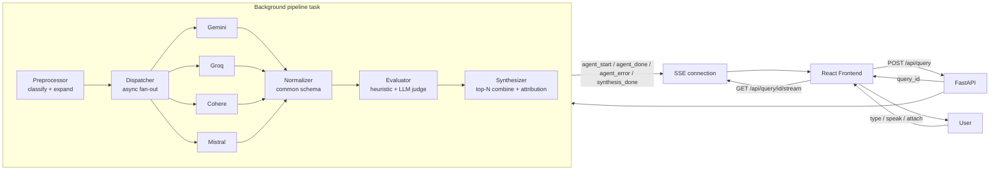
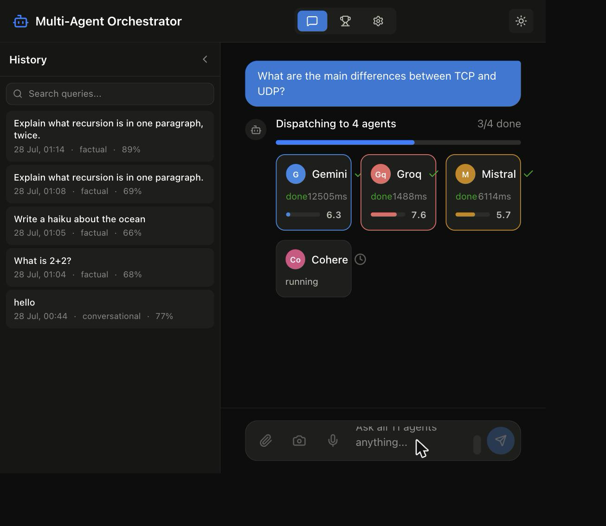
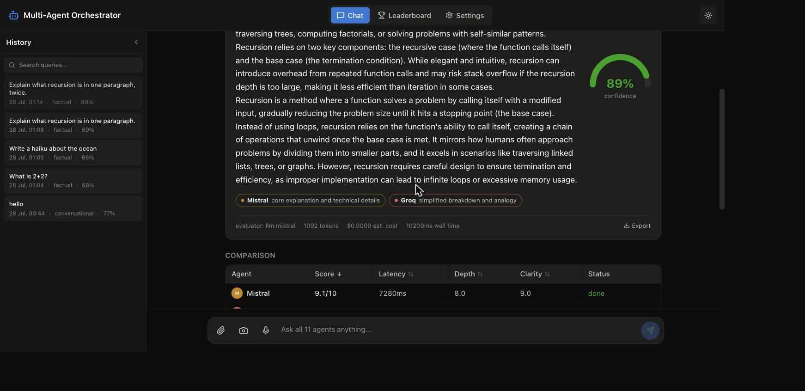

# Multi-Agent Orchestrator

Ask one question, get answers from every model at once — dispatched in parallel, scored on five dimensions, and synthesized into a single answer with full attribution.

[](https://frontend-five-jet-72.vercel.app)
[](https://www.python.org/)
[](https://react.dev/)
[](https://fastapi.tiangolo.com/)
[](https://vitejs.dev/)
[](LICENSE)
[](backend/tests)

> **🚀 Try the live demo: [frontend-five-jet-72.vercel.app](https://frontend-five-jet-72.vercel.app)** — no setup required. Backend runs on Render's free tier, so the first request after idle may take ~30-60s to cold-start.


*See [docs/SCREENSHOTS.md](docs/SCREENSHOTS.md) for exactly how this and the screenshots below were captured.*

## Table of Contents

- [Overview](#overview)
- [Key Features](#key-features)
- [Architecture](#architecture)
- [Screenshots](#screenshots)
- [Tech Stack](#tech-stack)
- [Getting Started](#getting-started)
- [Usage](#usage)
- [Agent Compatibility Matrix](#agent-compatibility-matrix)
- [API Reference](#api-reference)
- [Project Structure](#project-structure)
- [Roadmap](#roadmap)
- [Contributing](#contributing)
- [License](#license)
- [Acknowledgments](#acknowledgments)

## Overview

Multi-Agent Orchestrator sends a single prompt to several LLM providers simultaneously, scores every response across five independent dimensions (accuracy, depth, clarity, relevance, conciseness), and produces one synthesized answer with per-agent attribution — not just a side-by-side transcript. Where ChatGPT and Perplexity give you one model's opinion, this gives you a **cross-validated** one: if two providers disagree on a fact, that disagreement is visible in the comparison table and factored into a confidence score, not hidden behind a single confident-sounding response.

It's built for the case where getting an answer wrong is worse than waiting three extra seconds — technical research, fact-checking, and anywhere a second (and third, and fourth) opinion is worth the latency. The pipeline degrades gracefully by design: an agent that's rate-limited, out of credit, or simply not configured is skipped, never crashes the run, and is clearly marked as such in the UI rather than silently omitted.

## Key Features

- ⚡ **Parallel dispatch** — every agent is called concurrently via `asyncio.gather`, with per-agent timeout and exponential-backoff retry, so one slow or dead provider never blocks the others
- 📊 **Multi-dimensional evaluation** — a dependency-free heuristic scorer (accuracy via cross-agent consensus, depth, clarity, relevance, conciseness) runs on every response with zero network calls, so scoring never depends on an LLM being available
- 🧠 **LLM-judge synthesis** — when two or more agents succeed, a designated judge model reviews all responses, overrides the heuristic scores with its own judgment, and writes a synthesized best answer with per-agent attribution
- 📡 **Real-time SSE streaming** — the frontend watches each agent go `waiting → running → done/error` live via Server-Sent Events, not a spinner and a single final payload
- 🖼️ **Multimodal input** — attach an image (routed directly to vision-capable agents, described in text for the rest) or a document (PDF/DOCX/text extracted server-side and injected as context); dictate the prompt and have the answer read back, both via the browser's native Web Speech API
- 🏆 **Agent leaderboard** — win rate, average score, and average latency per agent, persisted in SQLite and filterable by query type (factual/creative/analytical/coding/conversational)
- 🛡️ **Graceful degradation** — missing API key, exhausted quota, network timeout, or malformed response: every failure mode is caught, labeled, and shown in the UI; the pipeline never hard-crashes on a bad agent
- 🔌 **Plugin architecture** — a new provider is a new file: subclass `BaseAgent`, implement one method, add a config block. The registry auto-discovers it via `pkgutil`; nothing else in the codebase changes

## Architecture



Every stage above is an independent, independently-tested module — the orchestrator wires them together but no stage knows about any other. See [docs/ARCHITECTURE.md](docs/ARCHITECTURE.md) for the full sequence diagram, a concrete prompt traced through every stage, and the reasoning behind each design decision.

## Screenshots

| Live agent dispatch | Comparison view |
|---|---|
|  |  |

Capture instructions for all three images are in [docs/SCREENSHOTS.md](docs/SCREENSHOTS.md).

## Tech Stack

| Layer | Technology | Why |
|---|---|---|
| Frontend framework | React 19 + Vite | Fast HMR dev loop; no framework-level SSR overhead needed for a client-rendered dashboard |
| Styling | Tailwind CSS v4 | Utility-first with CSS-variable-driven theming (dark/light without a second build) |
| Animation | Framer Motion | Declarative enter/exit transitions for agent cards without hand-rolled CSS keyframes |
| Charts | Recharts | Composable SVG charts for the leaderboard without a heavyweight charting engine |
| HTTP client | Axios | Consistent request/response interceptor surface across all API calls |
| Streaming | Server-Sent Events (native `EventSource`) | One-directional server→client push is all this needs; see [ARCHITECTURE.md](docs/ARCHITECTURE.md) for why this beat WebSockets here |
| Backend framework | FastAPI | Async-native, typed request/response models, automatic OpenAPI docs at `/docs` |
| ASGI server | Uvicorn | Standard FastAPI production/dev server, `--reload` for local iteration |
| HTTP client (server-side) | httpx (async) | One async client shared across every provider adapter — no per-provider SDK dependency tree |
| Data layer | SQLite | Zero-ops embedded storage for query history, leaderboard aggregates, and the response cache — no external DB for a single-instance app |
| File parsing | PyMuPDF, python-docx | PDF and DOCX text extraction for the file-attachment pipeline |
| Testing | pytest, pytest-asyncio | Async-native test runner matching the fully-async pipeline |
| Package/runtime | Python 3.11+, Node 18+ | Modern async syntax (`async with`, structural pattern matching) and current LTS Node |

## Getting Started

**Just want to try it?** Skip local setup entirely — the live demo above is a full deployment (Vercel frontend + Render backend) with all four agents (Gemini, Groq, Cohere, Mistral) configured.

### Prerequisites

- Python 3.11+
- Node.js 18+
- At least one LLM provider API key (a free-tier Gemini key is enough to run everything end-to-end)

### One-command setup

```bash
git clone https://github.com/kamil-ctr/multi-agent-orchestrator.git
cd multi-agent-orchestrator

# Backend
cd backend && python3 -m venv venv && source venv/bin/activate
pip install -r requirements.txt && cd ..

# Frontend
cd frontend && npm install && cd ..

# Config
cp .env.example .env   # then fill in whichever keys you have

./start.sh              # backend on :8000, frontend on :5173
```

Open **http://localhost:5173**.

### `.env` template

The 4 active providers are listed in [`.env.example`](.env.example) — each has its own `config.yaml` block (see [Agent Compatibility Matrix](#agent-compatibility-matrix)):

```bash
# Google Gemini — https://aistudio.google.com/app/apikey
GEMINI_API_KEY=

# Groq — https://console.groq.com/keys
GROQ_API_KEY=

# Cohere — https://dashboard.cohere.com/api-keys
COHERE_API_KEY=

# Mistral AI — https://console.mistral.ai/api-keys
MISTRAL_API_KEY=
```

## Usage

```bash
# Start both servers
./start.sh

# ...or separately, for backend-only iteration:
cd backend && source venv/bin/activate && uvicorn main:app --reload --port 8000
cd frontend && npm run dev

# Run the test suite
cd backend && pytest -v

# Run the fixed benchmark suite against every active agent
cd backend && python cli.py benchmark --output benchmark_report.json

# CLI mode (Rich terminal UI, same pipeline as the web app)
cd backend && python cli.py ask "Explain how quicksort works"
cd backend && python cli.py leaderboard
```

Once the servers are running, open the browser, type or speak a prompt (optionally attach an image or document), and watch the four agent cards resolve live before the synthesized answer and comparison table appear.

## Agent Compatibility Matrix

Four providers are active today, each through the same plugin adapter interface:

| Agent | Model |
|---|---|
| Gemini | `gemini-flash-latest` |
| Groq | `llama-3.1-8b-instant` |
| Cohere | `command-r-08-2024` |
| Mistral | `mistral-small-latest` |

**To add another provider:** subclass `BaseAgent` in a new `backend/agents/*.py` file, implement `_call_api`, and add a config block to `backend/config.yaml` — the registry auto-discovers it via `pkgutil`, no other file needs to change.

## API Reference

Interactive OpenAPI docs are auto-generated by FastAPI at `http://localhost:8000/docs` once the backend is running. Summary:

| Method | Path | Description | Request | Response |
|---|---|---|---|---|
| `POST` | `/api/query` | Starts a pipeline run as a background task | `{prompt: str, image_base64?: str, image_mime?: str, file_context?: str, file_name?: str, use_cache?: bool, enabled_agents?: string[]}` | `{query_id: str}` |
| `GET` | `/api/query/{id}/stream` | SSE stream of pipeline lifecycle events | — | `event: agent_start\|agent_done\|agent_error\|synthesis_done\|fatal_error`, each with a JSON `data:` payload |
| `POST` | `/api/upload` | Extracts text from a document or base64-encodes an image | multipart `file` | `{kind: "file"\|"image", filename, content?, preview?, mime_type?, data_base64?, size_bytes}` |
| `GET` | `/api/history` | Paginated query history | query params: `page, page_size, search?` | `{page, page_size, total, total_pages, items: [...]}` |
| `GET` | `/api/history/{id}` | Full result for one past query | — | Full `PipelineResult` JSON |
| `GET` | `/api/leaderboard` | Aggregated agent performance | query param: `query_type?` | `{query_type, rows: [{agent, total_runs, successes, avg_score, avg_latency_ms, success_rate}]}` |
| `GET` | `/api/agents` | Configured agents + live availability | — | `[{name, model, supports_vision, enabled, available, key_configured, timeout_s, max_retries}]` |
| `GET` | `/api/export/{id}?format=md\|pdf` | Downloads a past query's report | query param: `format` | File download (`text/markdown` or `application/pdf`) |
| `GET` | `/api/health` | Liveness + agent count | — | `{status: "ok", agents_available: int}` |
| `GET` | `/health` | Bare liveness check for platform health probes (Render, etc.) | — | `{status: "ok"}` |

CORS is restricted to the origins listed in the `CORS_ORIGINS` env var (defaults to `http://localhost:5173`; the live deployment also allows the deployed frontend's origin).

## Project Structure

```
multi_agent_orchestrator/
├── .env.example              # all 4 active provider keys, documented
├── start.sh                   # one-command dev startup
├── docs/
│   ├── ARCHITECTURE.md         # pipeline deep-dive, sequence diagram, design decisions
│   ├── SCREENSHOTS.md           # exact capture instructions
│   ├── RESUME.md                 # resume bullets + LaTeX/LinkedIn formatting
│   └── screenshots/               # hero.png, live-progress.png, comparison-view.png
├── backend/
│   ├── agents/                 # one adapter per provider (BaseAgent subclasses)
│   │   ├── base.py              # retry/timeout/backoff, generate()/vision contract
│   │   ├── registry.py           # auto-discovers agents/*.py — drop-in extensibility
│   │   └── *_agent.py             # gemini, groq, cohere, mistral
│   ├── core/
│   │   ├── schemas.py            # AgentResponse / EvaluationScore / PipelineResult / ImageInput
│   │   ├── config.py              # config.yaml + .env loader
│   │   ├── cache.py                # SQLite prompt-hash cache, TTL-based
│   │   ├── history.py               # SQLite query history + leaderboard aggregation
│   │   ├── cost_tracker.py           # token + cost estimation
│   │   ├── file_extract.py            # pdf/docx/plain-text extraction, 10MB cap
│   │   └── logger.py
│   ├── pipeline/
│   │   ├── preprocess.py         # Stage 1 — classify + expand
│   │   ├── dispatch.py            # Stage 2 — parallel dispatch (+ per-agent image routing)
│   │   ├── normalize.py            # Stage 3
│   │   ├── evaluate.py              # Stage 4 — heuristic + LLM-judge scoring
│   │   ├── synthesize.py             # Stage 5
│   │   └── orchestrator.py            # run() for the CLI, run_streaming() for the API
│   ├── api/                      # FastAPI routers: query, upload, history, leaderboard, agents, export
│   ├── ui/                       # Rich terminal UI (cli.py) + Markdown/PDF export
│   ├── benchmark/                 # fixed prompt suite + runner
│   ├── tests/                      # pytest + pytest-asyncio, 24 tests
│   ├── config.yaml                  # active agent roster, models, timeouts, retries
│   ├── main.py                       # FastAPI app (`uvicorn main:app`)
│   └── cli.py                         # Typer CLI entrypoint
└── frontend/
    └── src/
        ├── api/                  # axios client, SSE helper, agent color/label metadata
        ├── components/            # ChatInput, AgentCard, ResultsPanel, ComparisonTable, ...
        ├── context/                 # theme (dark default) + settings (agent toggles, voice)
        ├── hooks/                    # useSpeechToText / useTextToSpeech (Web Speech API)
        └── views/                     # ChatPage, LeaderboardPage, SettingsPage
```

## Roadmap

- [ ] **Token-by-token streaming** — stream each agent's response as it's generated rather than waiting for the full completion, using SSE deltas from providers that support it
- [ ] **Conversation memory** — multi-turn context carried across queries within a session, not just single-shot prompts
- [ ] **Semantic caching** — cache hits keyed on embedding similarity rather than exact prompt-hash match, so paraphrased repeat questions still hit the cache
- [ ] **Agent explainability** — surface *why* the judge scored a response the way it did, beyond the current strengths/weaknesses one-liner

## Contributing

Issues and PRs are welcome. Before opening a PR:

1. `cd backend && pytest -v` — all tests must pass
2. Run `python cli.py ask "..."` or the full web flow to confirm the change works end-to-end, not just in isolation
3. New agent adapters: follow the pattern in [Agent Compatibility Matrix](#agent-compatibility-matrix) and `backend/agents/registry.py` — subclass `BaseAgent`, add a config block, no other file should need to change

## License

[MIT](LICENSE) © Kamil

## Acknowledgments

Built on the free-tier APIs of Google (Gemini), Groq, Cohere, and Mistral AI. UI components built with [React](https://react.dev/), [Tailwind CSS](https://tailwindcss.com/), [Framer Motion](https://www.framer.com/motion/), [Recharts](https://recharts.org/), and [Lucide](https://lucide.dev/) icons.
