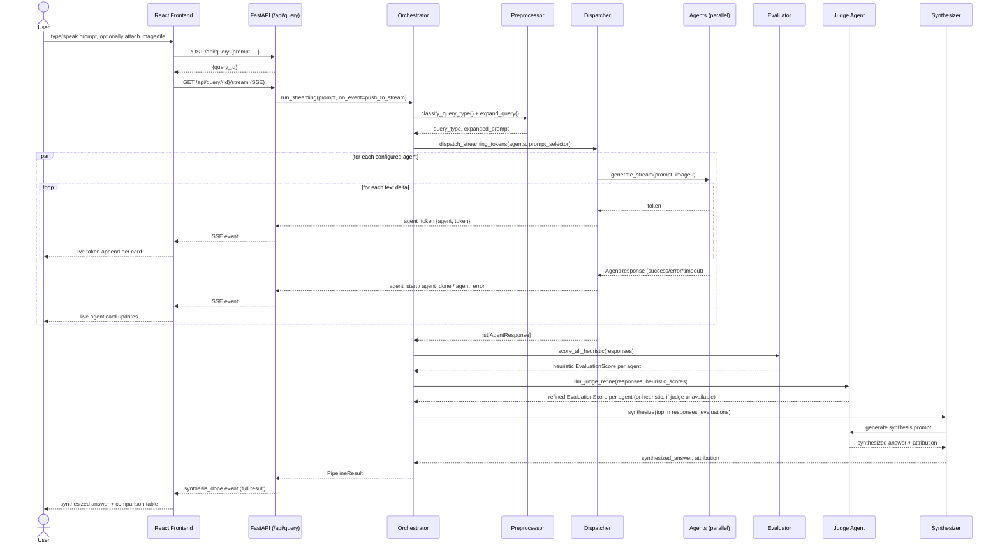

# Architecture

This document covers the pipeline internals: how a prompt moves through five stages, why each stage exists, and the reasoning behind the structural decisions (async, plugin registry, SSE, heuristic+LLM-judge hybrid). For setup and usage, see the [README](../README.md).

## Table of Contents

- [Sequence Diagram](#sequence-diagram)
- [Component Responsibilities](#component-responsibilities)
- [Data Flow: A Concrete Example](#data-flow-a-concrete-example)
- [Design Decisions](#design-decisions)
- [Trade-offs and Future Improvements](#trade-offs-and-future-improvements)

## Sequence Diagram



## Component Responsibilities

| Component | File | Responsibility |
|---|---|---|
| **Preprocessor** | `pipeline/preprocess.py` | Classifies query type via keyword heuristics (no network call); optionally expands/clarifies the prompt through a lightweight LLM call before dispatch |
| **Dispatcher** | `pipeline/dispatch.py` | Fans out to every enabled agent concurrently via `asyncio.gather`/`asyncio.as_completed`; routes images only to vision-capable agents |
| **BaseAgent** | `agents/base.py` | Owns per-agent timeout, exponential-backoff retry, and latency tracking — every adapter inherits this for free and only implements the HTTP call itself |
| **Registry** | `agents/registry.py` | Discovers `BaseAgent` subclasses via `pkgutil.iter_modules` and instantiates the ones present in `config.yaml` |
| **Normalizer** | `pipeline/normalize.py` | Reduces every agent outcome (success, timeout, error, disabled, rate-limited) to one common `AgentResponse` shape and computes aggregate stats |
| **Evaluator** | `pipeline/evaluate.py` | Runs the dependency-free heuristic scorer on every response, then optionally hands off to an LLM judge for refinement |
| **Synthesizer** | `pipeline/synthesize.py` | Combines the top-N scoring responses into one answer via a judge-model call, with a verbatim-response fallback if no judge is available |
| **Orchestrator** | `pipeline/orchestrator.py` | Wires the five stages together; `run()` serves the CLI, `run_streaming()` serves the API and emits lifecycle events for SSE |
| **Cache** | `core/cache.py` | SQLite prompt-hash cache with TTL expiry — bypassed automatically for image/file-attached queries, since those carry state the hash doesn't capture |
| **History** | `core/history.py` | SQLite-backed query history and leaderboard aggregation (win rate, avg score, avg latency per agent, per query type) |

## Data Flow: A Concrete Example

Real trace from a production run of `POST /api/query` with `{"prompt": "Explain what recursion is in one paragraph."}` and four active agents (Gemini, Groq, Cohere, Mistral).

**Stage 1 — Preprocess.** `classify_query_type` sees no coding/creative/analytical keyword hits, no `?` suffix, but matches the `explain` prefix → `query_type = "factual"`. The judge agent (Gemini) then expands the prompt:
```
"Provide a clear and concise explanation of the concept of recursion, as it
applies to computer science and mathematics, formatted strictly as a single
paragraph."
```

**Stage 2 — Dispatch.** All four agents receive the expanded prompt concurrently. Results arrive out of order as each completes:

| Agent | Latency | Status |
|---|---|---|
| Groq | 785ms | success |
| Mistral | 1,990ms | success |
| Gemini | 5,594ms | success |
| Cohere | 18,181ms | success (1 retry) |

Each arrival immediately emits an `agent_done` SSE event with a *provisional* heuristic score computed against whichever peers have landed so far — the frontend's live score badge updates incrementally rather than waiting for the full set.

**Stage 3 — Normalize.** All four responses are already in `AgentResponse` shape; normalization here is a no-op pass plus aggregate stats (4/4 succeeded, 963 total estimated tokens).

**Stage 4 — Evaluate.** The heuristic scorer runs first — it's deterministic and requires no network. Because ≥2 agents succeeded, the judge (Gemini) is then invoked to refine those scores. Its refinement caught something the heuristic couldn't: Cohere's response listed several unit conversions (mm/s, km/s, mi/s) with **arithmetic errors**. The heuristic scorer, which only measures structural properties like word overlap and sentence length, had no way to know that — it scored Cohere in line with the others. The judge, actually reading the content, dropped Cohere's `accuracy` to 2.0/10:

| Agent | Accuracy | Depth | Clarity | Relevance | Conciseness | Overall |
|---|---|---|---|---|---|---|
| Gemini | 10.0 | 10.0 | 10.0 | 10.0 | 9.0 | **9.9** |
| Mistral | 10.0 | 8.0 | 10.0 | 10.0 | 9.0 | **9.5** |
| Groq | 8.0 | 7.0 | 8.0 | 10.0 | 8.0 | **8.3** |
| Cohere | 2.0 | 5.0 | 8.0 | 10.0 | 8.0 | **6.1** |

This is the concrete case for running a judge at all: a purely structural heuristic cannot catch a factually wrong answer that *reads* well.

**Stage 5 — Synthesize.** The top 3 responses (Gemini, Mistral, Groq — Cohere's low accuracy score dropped it out of the top-N window) are sent back to the judge with instructions to combine their strongest elements. The result:

```
attribution: {
  "gemini": "Comprehensive breakdown by unit category, exact SI definition
              context, rule of thumb, and structure",
  "mistral": "AU/day unit detail and SI definition context",
  "groq": "Additional unit conversions and verification"
}
confidence_score: 92.9
evaluator_used: "llm:gemini"
```

Confidence combines the top score, cross-agent score variance (agreement), and success rate — 92.9% here reflects both a high top score *and* three of four agents converging on the same core facts.

## Design Decisions

**Why async everywhere.** Every agent call is I/O-bound (waiting on an HTTP round trip to a third-party API) — the workload is a textbook case for `asyncio` over threads. `asyncio.gather` for the CLI's simple case and `asyncio.as_completed` for the streaming case let every concurrent HTTP call share a single event loop with no thread pool, no GIL contention, and predictable cancellation semantics if one call hangs past its timeout.

**Why a plugin registry over a hardcoded agent list.** `agents/registry.py` walks the `agents/` package with `pkgutil.iter_modules`, finds every `BaseAgent` subclass, and instantiates the ones present in `config.yaml`. Adding a new provider means writing one adapter file and one config block — zero changes to `orchestrator.py`, `dispatch.py`, or any other stage. This was validated directly during development: multiple additional providers were integrated (and later retired as their accounts hit account-side limits) without touching a single line outside `agents/`.

**Why SSE over WebSockets.** The data only ever flows one direction — server pushes lifecycle events, the client never needs to send anything mid-stream. SSE (`EventSource`) gives that for free: automatic reconnection, plain HTTP (no upgrade handshake, no special proxy/load-balancer configuration), and a simpler server implementation (`StreamingResponse` yielding text, no connection-state machine to manage). WebSockets would add bidirectional complexity this app doesn't use. The one WebSocket advantage — lower per-message overhead — doesn't matter at this event volume (under 20 events per query).

**Why a heuristic scorer *and* an LLM judge, not just one.** A pure-LLM evaluator makes the entire scoring stage depend on network availability and adds latency and cost to every query. A pure heuristic can't catch factual errors — see the Cohere example above. The hybrid gets both: the heuristic is the always-available baseline (deterministic, unit-tested, works fully offline), and the judge is a strict improvement layered on top when at least two agents succeed and a judge is configured. If the judge call fails or returns malformed output, the heuristic scores stand — evaluation never hard-fails.

## Trade-offs and Future Improvements

- **Judge is a single point of correlated bias.** Using one agent (Gemini) as both judge and synthesizer means its own blind spots and formatting preferences shape both the score and the final answer. A future version could rotate the judge across agents or use a distinct, cheaper model dedicated to judging.
- **Provisional live scores are approximate.** The score shown on an agent's card the moment it completes is computed against whatever peers have landed *so far*, not the final peer set — it can shift slightly by the time the comparison table renders. This is a deliberate UX trade-off (immediate feedback over perfect accuracy on an intermediate value) rather than an oversight.
- **Cache granularity is exact-match only.** The response cache is keyed on a hash of the literal prompt string; a paraphrased repeat question is a cache miss. [Semantic caching](../README.md#roadmap) is the planned fix.
- **No token-level streaming yet.** Agents are awaited to completion before their card updates — the "live" element is *which agent finishes when*, not the text appearing incrementally. True token streaming is on the [roadmap](../README.md#roadmap) but requires per-provider streaming-response parsing that the current uniform `_call_api` contract doesn't yet support.
